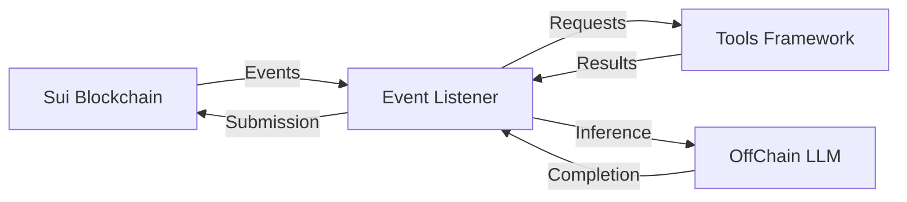

# Introduction

This system provides an integrated solution for LLM (Large Language Model) inference with tool execution capabilities, built on top of the Sui blockchain. It consists of three main components:

## Architecture Components

### 1. OffChain LLM Inference
The OffChain component handles direct interactions with LLM models, providing a clean interface for making inference requests. Key features:
- Flexible model selection
- Configurable inference parameters
- Error handling and retry logic
- Environment-based configuration

### 2. Tools Framework
A extensible collection of utility tools that can be called during inference:
- Web search capabilities
- File and system operations
- AI and vision processing
- Research and data retrieval
- Easy framework for adding new tools

### 3. Blockchain Event Listener
Connects the system to the Sui blockchain by:
- Monitoring for inference requests
- Managing tool execution
- Handling completion submissions
- Maintaining transaction integrity

## How It Works

1. **Event Triggering**: The system listens for `RequestForCompletionEvent` events on the Sui blockchain
2. **Request Processing**: When an event is detected, the system:
   - Extracts request parameters
   - Executes any required tools
   - Processes the LLM inference request
3. **Response Handling**: Results are sanitized and submitted back to the blockchain

## Getting Started

### Prerequisites
- Sui blockchain access
- LLM model access
- Required API keys for specific tools
- Python environment

### Basic Setup

1. Set environment variables:
```bash
export PACKAGE_ID="your_package_id"
export SUI_PRIVATE_KEY="your_private_key"
export MODEL_OWNER_CAP_ID="your_model_owner_cap_id"
export LLM_ASSISTANT_URL="http://localhost:8080/predict"
```

2. Install dependencies:
```bash
pip install pysui aiohttp python-dotenv requests
```

3. Start the event listener:
```bash
python event_listener.py
```

## System Interaction



## Next Steps

- Review the detailed documentation for each component
- Configure specific tools and models
- Set up monitoring and logging
- Implement custom tools as needed

For detailed information about specific components, please refer to their respective documentation sections.